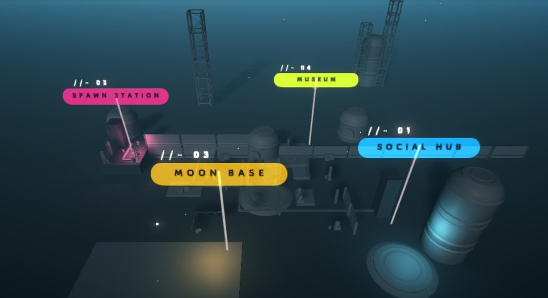

# Overview

## Facilities of Bobot-Verse

The ecosystem mechanics for Bobots is split into a few locations:

* **Spawning Station**&#x20;
* **Social Hub**
* **Moon Base**
* **Museum**

## Spawning Station

The spawning station is where players are able to mint their bobots and their lands.&#x20;


[spawn-station.md](spawn-station.md)


## Museum

The museum is where players are able to read the lore and see the different lore with the different partnerships that we have. &#x20;


[mining-quest.md](mining-quest.md)


## Moon Base

Expand the moon base by increasing the power points of all the Bobots. See more here:


[moon-base-expansion.md](moon-base-expansion.md)


## **Social Hub**

Chat and interact with other Bobots in realtime. See more here:


[social-hub.md](social-hub.md)

