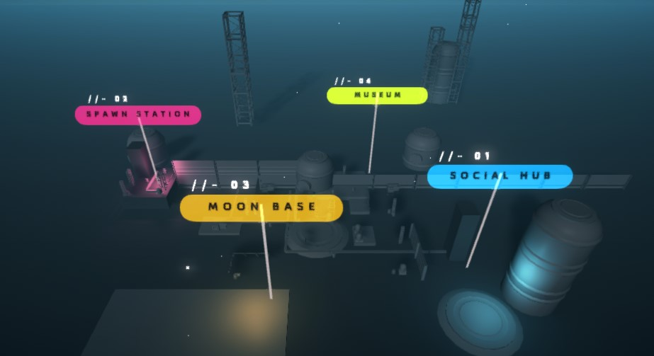

# Game Features

Bobots is structured to be a game that can be built upon as it grows and matures with the community. As long as players have Bobots, they will have access to all current and future experiences in the Bobots Universe!&#x20;

### Bridge

Players will be greeted by the Bridge when they first enter the game. Here, the player can access every other facility in the Monolift Carrier.&#x20;

The following is a list of facilities that players can interact with:&#x20;

### Facilities


[boot-up-station.md](boot-up-station.md)



[moon-base](moon-base/)



[central-hub.md](central-hub.md)



[black-box.md](black-box.md)

