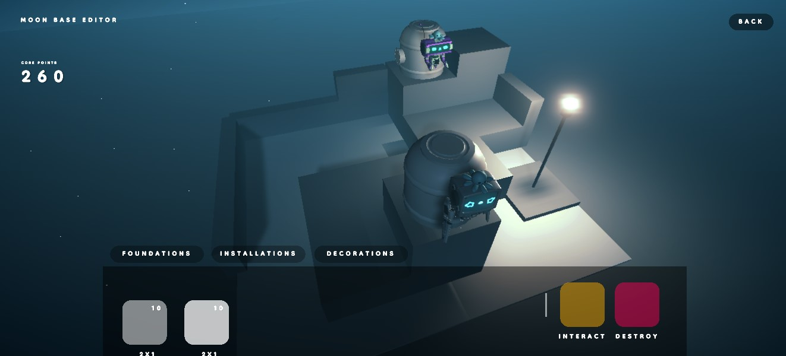

# 🌗 Moon Base

The Moon Base will be the baseline of gameplay in the Bobots metaverse. In the Moon Base, players will be able to stake Bobots to collect Core Points and $MAGIC. The resources gained from staking can then be used to craft and build more structures, thus increasing the returns a player can get over time!

There are 3 core systems that make up the Moon Base:&#x20;

* **Staking System**
* **Crafting System**
* **Leveling System**

## **Core Points** 

To introduce progression to the building of the moon base, we have incorporated the bobot staking mechanic to allow players to earn core points. These core points will determine how many Lands and Decorations can be placed in the moon base. Different structures in the game will cost different amounts of Core Points to be placed, and these Core Points will be returned to the player when a structure is removed from the Moon Base.&#x20;

Core points can be earned by staking Bobots in the Core Chamber and Launch Pad. Core Points will also determine the level of a Bobot, and each Bobot has a maximum amount of Core Points that they can accumulate.&#x20;

If a player loses possession of a Bobot, they will also lose all the Core Points earned by this Bobot. Structures can no longer be placed down until the total cost of Core Points for all structures placed in the Moon Base falls below the amount of Core Points a player owns.

## Staking System

Players can stake their Bobots on any of their lands placed in their Moon Base. Players can stake their Bobots to earn Core points and $MAGIC. The rates of collecting these resources will differ for the different tiers of Bobots and the Lands they are staked on.

## Crafting System

Players can obtain new Lands by crafting them through the Crafting Table. Each player owns 1 Crafting Table, and it must be placed in the Moon Base in order to craft Lands.&#x20;

## Leveling System

Bobots level up while earning core points. Bobots level up once they have earned the maximum amount of core points for their current level, up to a max level determined by the collection that the Bobot originates from.&#x20;

Features that use the Leveling System will be introduced in the future.&#x20;
