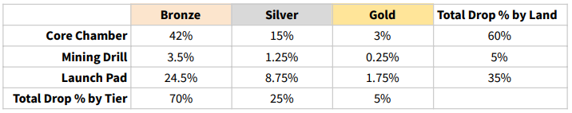

# Crafting Table

Every player owns 1 Crafting Table. After placing it down, a player can then start creating new Land NFTs to use or sell in the Marketplace. Once crafting has started, the player will receive the new Land at the end of the crafting duration.&#x20;

* **Price to Craft:** 10 $MAGIC
* **Crafting Duration:** 48hrs

Below is a table showing the drop rates for each structure and tier:&#x20;

More details on the Land NFTs:&#x20;


[land-nfts](../../../nfts/land-nfts/)

