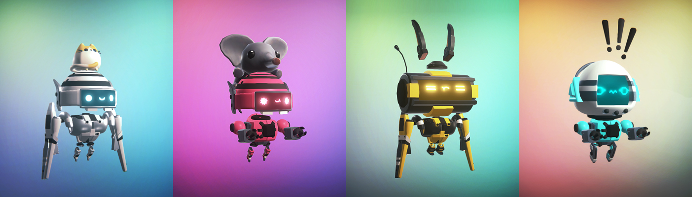

# Genesis Bobots

Lively, reliable, and pretty much indestructible, Genesis Bobots are humanity's pride and joy. They are sturdy workers that can really put in work! Due to the rarity of the resources required to create the Genesis Bobots, they are limited in quantity.&#x20;

### Welcome Package

Along with the Bobot, new BBNauts will receive 1 bronze tier Mining Drill, 1 bronze tier Core Chamber, and 1 bronze tier Launchpad to kickstart their Moon Base journey!&#x20;

### Specs

**Minting Cost:** Free!

**Supply:** 4040

**Purchase Limit:** Unlimited

**Max Level:** 10

**Max Core Points:** 9600

The following table is the amount of core points that BBNauts can earn:

### Avatars

Initially built for the L1 blockchain, all Bobots are carefully designed and have the following design guidelines:&#x20;

* **In Game Renders in 3D** - All images videos are captured in the game engine hence what you see is what you will get.
* **Fully animated** - Bobots are rigged and animated
* **Realtime effects** - All Bobots have particles and effects attached to them ( exhaust, etc)

#### Rarity

All traits of Bobots are split into 5 different categories.

Rarity Rank

* Common&#x20;
* Uncommon&#x20;
* Rare&#x20;
* Ultra rare&#x20;
* Legendary

#### Assets

A Bobot is divided into many different parts, each holding a certain rarity rank.

Asset Pool

* 10 Head Models&#x20;
* 20+ Hat Models&#x20;
* 5 Arm Models&#x20;
* 5 Leg Models&#x20;
* 10+ LCD Textures&#x20;
* 30+ Colour Palettes

Asset pool is still being refined at this moment.

Head

Hat

LCD

Color Palette

Arm

Body

Export Types

For the metadata, the Bobots will be captured in jpg, gif and mp4 format.

