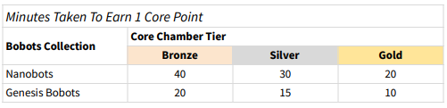

# 🔋 Core Chamber

 (1) (1).png>)

Earns Core Points and levels up staked Bobots over time, up to a limit. The tier of the Bobot will affect how fast the Bobot will take to level up, and the maximum amount of Core Points it can hold. If the player decides to unstake, the full stake cost will be returned to the player.

**Stake cost:** 5 $MAGIC

### Tier Bronze

**Break Immunity:** 750 core points&#x20;

**Break Chance:** 10% chance of breaking per 100 core points earned after 750 total core points gained from this unit.

### Tier Silver

**Break Immunity:** 1000 core points&#x20;

**Break Chance:** 7.5% chance of breaking per 100 core points earned after 1000 total core points gained from this unit.

### Tier Gold

**Break Immunity:** 2000 core points&#x20;

**Break Chance:** 5% chance of breaking per 100 core points earned after 2000 total core points gained from this unit.
